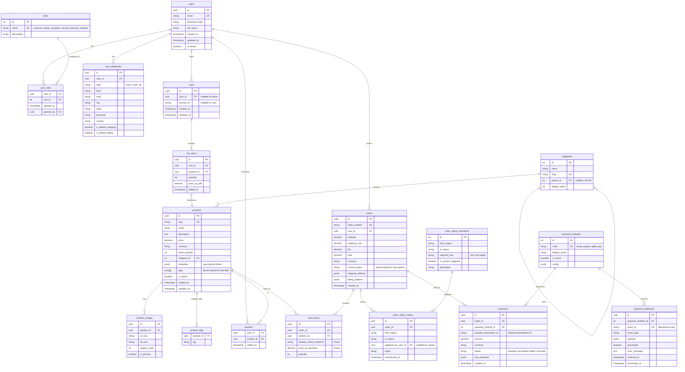

# P14 Database ER Diagram & Schema Design

This schema bakes in **4 future-proof architectural decisions** so that when you add Phase 3 features (subscriptions, recommendations, fraud rules, vendors), you change data and config — not code structure.

## The 4 architectural decisions, visualized

| # | Decision | Why it matters | Tables involved |
|---|---|---|---|
| 1 | Order state in a **transitions table**, not hardcoded enum | Add `refund_pending`, `return_requested` later without code changes | `order_status_transitions`, `order_status_history` |
| 2 | **Multi-role users** via many-to-many | Add `vendor`, `premium_member`, `support_agent` roles later | `users`, `roles`, `user_roles` |
| 3 | **Payment provider abstraction** | Swap Stripe → PayPal, or add Apple Pay, without rewriting checkout | `payment_methods`, `payments`, `payment_webhooks` |
| 4 | **Product tags + metadata JSONB** | Future recommendation, faceted search, product-type-specific fields | `products.tags[]`, `products.metadata`, `product_tags` |

---

## ER Diagram



---

## Schema notes (per architectural decision)

### Decision 1: Order state machine via tables

The `order_status_transitions` table is your **state machine config**, seeded at startup:

```sql
-- Sample seed data
INSERT INTO order_status_transitions (from_status, to_status, required_role, is_system_triggered, description) VALUES
  ('pending',    'paid',       NULL,    true,  'Webhook confirms successful payment'),
  ('pending',    'cancelled',  'customer', false, 'Customer abandoned checkout'),
  ('paid',       'processing', 'admin', false, 'Admin starts fulfilment'),
  ('paid',       'cancelled',  'admin', false, 'Admin cancels paid order (triggers refund)'),
  ('processing', 'shipped',    'admin', false, 'Admin marks shipped, courier assigned'),
  ('shipped',    'completed',  NULL,    true,  'Auto-completed after 14 days'),
  ('shipped',    'completed',  'customer', false, 'Customer confirms received'),
  ('paid',       'refund_pending', 'admin', false, 'Refund initiated, awaiting processor'),
  ('refund_pending', 'refunded', NULL, true,  'Stripe webhook confirms refund');
```

Every state change writes to `order_status_history` so you have a complete audit trail.

The `orders.current_status` field is **denormalized** for fast filtering (`WHERE current_status = 'paid'`). Truth lives in history; this is just a cache of the latest row.

### Decision 2: Multi-role users

The `roles` table starts with three rows: `customer`, `admin`, `sysadmin`. Adding a new role later is one SQL insert. Your authorization code checks roles via JWT claims like:

```csharp
[Authorize(Roles = "admin")]  // works
[Authorize(Roles = "admin,vendor")]  // also works after adding vendor
```

A user can have multiple roles (e.g., a vendor who is also a premium customer).

### Decision 3: Payment provider abstraction

`payment_methods` table is a registry. Stripe is one row. Adding PayPal = one row + one new `IPaymentProvider` implementation class. The `payments` table is provider-agnostic — `provider_transaction_id` works for any gateway.

The `payment_webhooks` table is **critical for idempotency**: every webhook event Stripe sends has a unique `event_id`. Store it before processing. If the same event arrives twice (Stripe retries), the unique constraint on `event_id` rejects the duplicate.

### Decision 4: Tags + JSONB metadata

Two complementary mechanisms:

- **`tags string[]`** on products → fast filter queries (`WHERE 'red' = ANY(tags)`), indexed with PostgreSQL GIN. Use for facets like color, brand, size category.
- **`metadata jsonb`** → product-type-specific fields. A T-shirt has `{"size": "M", "material": "cotton"}`; a laptop has `{"ram_gb": 16, "cpu": "M2"}`. P14 PDF specifically calls out "products to be labelled with matching details based on product type" — this is how you implement it without 50 nullable columns.

Future recommendation engine ("customers who bought X also bought Y") can use tag overlap as a cheap similarity signal before you need real ML.

---

## Indexing strategy (create from Sprint 2 onward)

```sql
-- Product search and filtering
CREATE INDEX idx_products_active_category ON products (category_id) WHERE is_active = true;
CREATE INDEX idx_products_tags_gin ON products USING GIN (tags);
CREATE INDEX idx_products_metadata_gin ON products USING GIN (metadata);
CREATE INDEX idx_products_fts ON products USING GIN (to_tsvector('english', name || ' ' || description));

-- Order queries
CREATE INDEX idx_orders_user_status ON orders (user_id, current_status, created_at DESC);
CREATE INDEX idx_orders_status_created ON orders (current_status, created_at DESC);

-- Cart lookup
CREATE INDEX idx_carts_user ON carts (user_id) WHERE user_id IS NOT NULL;
CREATE INDEX idx_carts_session ON carts (session_id) WHERE session_id IS NOT NULL;

-- Payment webhook idempotency (critical)
CREATE UNIQUE INDEX idx_payment_webhooks_event_id ON payment_webhooks (event_id);
```

---

## Migration order (Sprint mapping)

| Sprint | Tables to create |
|---|---|
| Sprint 1 | `users`, `roles`, `user_roles`, `user_addresses` |
| Sprint 2 | `categories`, `products`, `product_images`, `product_tags` |
| Sprint 3 | `carts`, `cart_items`, `wishlists` |
| Sprint 4 | `payment_methods`, `payments`, `payment_webhooks` |
| Sprint 5 | `orders`, `order_items`, `order_status_transitions`, `order_status_history` (and seed transitions) |

Note: Although `orders` logically depends on `payment_methods`, you can create `orders` in Sprint 4 and add the payment relationship as part of the same sprint — the table ordering above shows the **focus** of each sprint.

---

## What this schema does NOT include (intentionally)

These would be added in **Phase 3** if you choose to extend:

- `subscriptions`, `subscription_plans` — for P102-style membership tiers
- `vendors`, `vendor_products` — for P105/P80-style multi-vendor marketplace
- `product_views`, `product_recommendations` — for recommendation engine
- `fraud_rules`, `fraud_evaluations` — for P135-style risk checks
- `coupons`, `discount_codes` — for promotional pricing

Each can be added as new tables without modifying the core schema above. That's the point of designing the foundation correctly.
