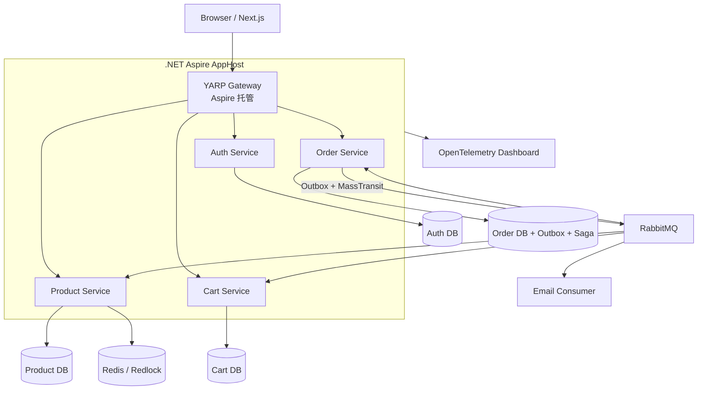
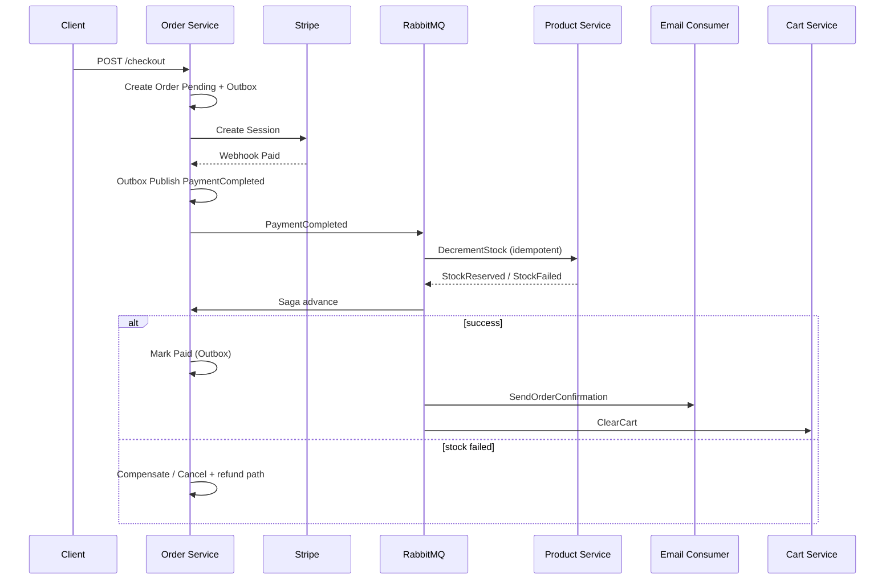

# PE-1 微服务最终方案 — Novacart

> **状态：** **已实施** — 默认 `docker compose up` 即微服务栈。遗留单体：`docker-compose.monolith.yml`。原单体设计见 [ARCHITECTURE_ZH.md](ARCHITECTURE_ZH.md)。
>
> 本文档是 Novacart **微服务 + 异步编排** 的**最终技术方案**，取代 README 中零散的 Consul/Ocelot 表述。
>
> 关联：[README §Planned Enhancements](../README_CN.md#planned-enhancements) · [HANDOFF §11](../HANDOFF.md#11-planned-enhancements-scaling-tail--not-scheduled) · [TODO.md PE-1](../TODO.md#pe-1--microservice-architecture) · [English](MICROSERVICES-PE1.md)

---

## 1. 最终技术栈（一览）

| 层次 | 选型 | 作用 |
|------|------|------|
| **编排 / 本地 DX** | **[.NET Aspire](https://learn.microsoft.com/dotnet/aspire/)** AppHost | 多服务一键启动、配置注入、Dashboard、OpenTelemetry |
| **API 网关** | **[YARP](https://microsoft.github.io/reverse-proxy/)** | 统一 `/api` 入口、路由、鉴权、限流 |
| **服务发现** | **Aspire Service Discovery** → 生产 **Kubernetes Service** | 无需 Consul（简化运维） |
| **同步容错** | **Polly** + `HttpClientFactory` | 重试、熔断、超时（服务间 HTTP） |
| **声明式 HTTP** | **Refit** | 服务间 API 客户端 |
| **消息总线** | **RabbitMQ** | 跨服务异步、削峰、解耦 |
| **消息框架** | **[MassTransit](https://masstransit.io/)** | 消费者、重试、DLQ、Saga 状态机 |
| **可靠发布** | **Transactional Outbox**（MassTransit EF 集成） | 与业务 DB 同事务写 Outbox，再投递 MQ |
| **分布式流程** | **MassTransit Saga**（Order 域） | 结账：支付 → 库存 → 邮件 → 清购物车 |
| **库存并发** | **Redis Redlock**（PE-4，与 PE-1 同阶段） | 多实例扣库存防超卖 |
| **可观测** | OpenTelemetry（Aspire 默认）→ Jaeger / Grafana | 链路追踪 |
| **部署** | Docker → **Kubernetes**（或 ECS） | Aspire 导出 manifest / Helm |

**不采用：** Consul/Ocelot 经典栈（仅作 Spring Cloud 对照参考，见 §6）。

**PE-2（RabbitMQ）与 PE-5（异步订单）** 已**并入本方案**，不再作为与 PE-1 平行的可选路径。

---

## 2. 触发条件

| 信号 | 说明 |
|------|------|
| 多团队独立发布 | Auth / Product / Cart / Order 分属不同小组 |
| 扩缩容 profile 不均 | 目录读多、结账写少，需独立扩容 |
| 进程内 `EmailQueue` 不够 | 多副本、持久化重试、DLQ |

**不应** 仅为答辩拆微服务——当前 Modular Monolith 已满足 P14。

---

## 3. 服务边界

| 服务 | 职责 | 数据库 |
|------|------|--------|
| **Auth** | 注册/登录、JWT、Refresh Token、角色 | `users`, `roles`, `user_roles`, `refresh_tokens` |
| **Product** | 目录、搜索、定价规则、Square 同步、库存 **扣减 API** | `categories`, `products`, `price_rules` |
| **Cart** | 购物车 CRUD、guest merge | `carts`, `cart_items` |
| **Order** | 结账、Stripe webhook、订单状态机、**Saga 编排**、Outbox 发布 | `orders`, `order_items`, `payments`, `outbox`, saga 状态表 |

**网关路由（示例）：** `/api/auth/**` → Auth；`/api/products/**` → Product；`/api/cart/**` → Cart；`/api/checkout/**`、`/api/orders/**` → Order。

Next.js 仍调用 `/api/*`，前端 URL **不变**。

---

## 4. 目标拓扑



---

## 5. MassTransit + RabbitMQ + Saga + Outbox

### 5.1 为什么需要

| 单体 today | 微服务后的问题 | 方案 |
|------------|----------------|------|
| Checkout 单 DB 事务 | 跨 Order / Product / Cart 无单一事务 | **Saga** 最终一致 |
| Webhook 内直接发邮件 | Order 服务不能同步调 SMTP | **RabbitMQ** 异步消费者 |
| `EmailQueue` 进程内 | 多实例丢消息、无 DLQ | **MassTransit** 持久化 + 重试 |
| 先改库再发 MQ 可能不一致 | 库提交了、MQ 挂了 | **Transactional Outbox** |

### 5.2 Transactional Outbox（MassTransit EF）

与 **Order 服务** 同一 PostgreSQL 事务：

1. 更新 `orders` 状态 / 写入业务表  
2. 写入 `outbox` 表（MassTransit 提供的 EF Outbox 实体）  
3. `COMMIT`  
4. MassTransit **Outbox dispatcher** 后台轮询 outbox → 发布到 RabbitMQ  

保证：**只要订单状态落库，事件一定会被投递**（at-least-once；消费者需幂等）。

### 5.3 结账 Saga（MassTransit State Machine）

以 **`OrderCheckoutSaga`** 为例（状态持久化在 Order DB）：



| 事件 / 命令 | 发布者 | 消费者 | 说明 |
|-------------|--------|--------|------|
| `PaymentCompleted` | Order（Outbox） | Product | 扣库存（Redlock + 幂等键 `orderId`） |
| `StockReserved` | Product | Order Saga | Saga 前进 |
| `StockReservationFailed` | Product | Order Saga | 补偿：取消订单 / 触发退款流程 |
| `OrderPaid` | Order（Outbox） | Email worker | 确认邮件（替代进程内 `EmailQueue`） |
| `ClearCartForOrder` | Order（Outbox） | Cart | 清空用户购物车 |

**幂等：** 所有消费者以 `orderId` / Stripe `event_id` 去重（与现有 `payment_webhooks` 唯一索引一致）。

### 5.4 与当前单体的映射

| 单体组件 | 微服务最终方案 |
|----------|----------------|
| `PaymentService.HandleWebhookAsync` 单事务 | Order 本地事务 + Outbox 发 `PaymentCompleted` |
| 事务内扣库存 | Product 消费者 + **Redlock** |
| `EmailQueue` + `EmailBackgroundWorker` | MassTransit 消费者 + MailKit |
| 事务内 `ClearCart` | Cart 消费者 |
| `RedisCacheService` 失效 | 各服务发 `CatalogChanged` 等事件（可选） |

---

## 6. 与 Spring Cloud 对照（最终方案行）

| 能力 | Spring Cloud | **Novacart 最终方案** |
|------|--------------|------------------------|
| 框架 | Spring Boot | ASP.NET Core 8+ |
| 云原生编排 | Spring Cloud K8s / 手写 | **.NET Aspire** |
| 注册发现 | Nacos / Eureka | **Aspire / K8s DNS** |
| 网关 | Spring Cloud Gateway | **YARP** |
| 熔断 | Sentinel | **Polly** |
| HTTP 客户端 | OpenFeign | **Refit** |
| 消息 | Spring Cloud Stream | **MassTransit + RabbitMQ** |
| 可靠发布 | 自建 Outbox / RocketMQ 事务消息 | **MassTransit EF Outbox** |
| 长流程 | Seata / 自研 | **MassTransit Saga** |
| 追踪 | Sleuth + Zipkin | **OpenTelemetry**（Aspire） |

Spring Cloud 是 **Java 模块化全家桶**；Novacart 最终方案是 **Aspire + YARP + MassTransit** 的 .NET 云原生组合，**不用 Seata**，用 **Saga + Outbox** 实现最终一致。

---

## 7. 实施阶段

```
Phase 0  单体：抽离 MassTransit 抽象接口（可选），文档对齐 ✅ 本文档
Phase 1  Aspire AppHost + 4 空服务 + RabbitMQ 容器 + YARP
Phase 2  Order 服务：Outbox + PaymentCompleted 事件（仍可与单体并行验证）
Phase 3  拆 Product + StockReserved 消费者 + Redlock
Phase 4  拆 Cart + ClearCart 消费者
Phase 5  MassTransit Saga 串联 + Email 消费者
Phase 6  第 4 库（cart）；K8s ingress/secrets；DLQ 监控 ✅  
Phase 7  Jaeger OTLP；MassTransit 邮件队列；Testcontainers；Admin DLQ UI ✅  
Phase 8  Refit 目录客户端；AppHost 四库；prod/K8s 完整化 ✅ — **PE-1 完成**
```

**原则：** 先 **消息 + Outbox**（在单体或 Order 服务内验证），再 **拆服务**；避免先拆四个库再补 MQ。

---

## 8. 相关链接

- [MassTransit — Transactional Outbox](https://masstransit.io/documentation/patterns/transactional-outbox)
- [MassTransit — Saga State Machines](https://masstransit.io/documentation/patterns/saga/state-machine)
- [.NET Aspire 文档](https://learn.microsoft.com/dotnet/aspire/)
- [Microsoft .NET Microservices 电子书](https://learn.microsoft.com/en-us/dotnet/architecture/microservices/)

---

| 日期 | 变更 |
|------|------|
| 2026-07-15 | 初版：双路线 + Spring 对照 |
| 2026-07-15 | **定稿：** Aspire + YARP + MassTransit + RabbitMQ + Saga + Outbox 为最终方案；PE-2/PE-5 并入 |
